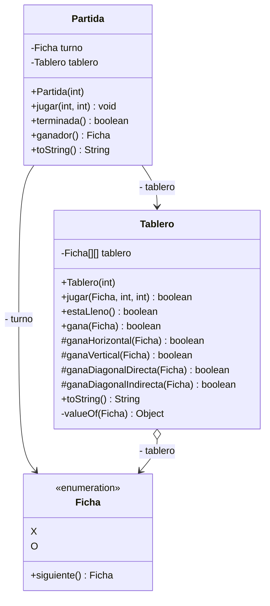

# Tres en Raya

Ejercicio de repaso del módulo **Despliegue de Aplicaciones Web 2026/27** (ILERNA): el juego del **tres en raya** implementado en Java siguiendo el diagrama de clases del enunciado, y jugado por consola.

## Requisitos

- JDK 21 o superior
- Maven 3.9+

## Compilar, probar y jugar

```bash
mvn clean package          # compila, ejecuta los tests y genera el jar
java -jar target/tres-en-raya-1.0.0.jar
```

Solo los tests: `mvn test` (50 tests JUnit 5).

## Cómo se juega

En cada turno se muestra la partida y se pide la casilla como **fila y columna del 1 al 3** separadas por un espacio (`1 1` es la esquina superior izquierda). Empieza X. Si la entrada no es válida o la casilla está ocupada, se vuelve a pedir la jugada al mismo jugador. Al terminar se muestra el resultado y se pregunta si se quiere jugar otra partida.

## Diagrama de clases

Implementado exactamente como en el enunciado (nombres, firmas y visibilidades):



## Estructura

```
src/main/java/es/ilerna/tresenraya/
├── Main.java                 # arranca la vista de consola
├── modelo/
│   ├── Ficha.java            # X, O y siguiente()
│   ├── Tablero.java          # casillas, jugadas, lleno, tres en raya, toString()
│   └── Partida.java          # turno + tablero, terminada(), ganador(), toString()
└── vista/
    └── VistaConsola.java     # bucle de juego por consola
openspec/                     # especificaciones (SDD con OpenSpec) y cambios archivados
```

## Correspondencia con el enunciado

| Enunciado | Implementación |
|---|---|
| La PARTIDA tiene un TABLERO y controla el TURNO | Atributos privados `tablero` y `turno` en `Partida` |
| ¿Quién calcula el `siguiente()` turno? La FICHA, su única responsabilidad | `Ficha.siguiente()`; la Partida lo usa tras cada jugada aceptada |
| La PARTIDA pide `jugar()` al TABLERO con ficha, fila y columna, y este responde si es posible | `Partida.jugar()` llama a `tablero.jugar(turno, fila, columna)`, que devuelve `false` si la casilla está ocupada |
| `terminada()`: el TABLERO estudia si `estaLleno()` o si alguna ficha `gana()` | `tablero.estaLleno() \|\| tablero.gana(X) \|\| tablero.gana(O)` |
| Tres en raya en horizontal, vertical o diagonales: cuatro métodos auxiliares | `gana()` = OR de los cuatro métodos `protected` |
| `ganador()` indica la FICHA ganadora | Devuelve X, O o `null` si no hay ganador |
| Pintar PARTIDA y TABLERO con `toString()` | La consola muestra `partida.toString()`, que incluye `tablero.toString()` |

## Decisiones de interpretación

1. El `int` de los constructores es la dimensión `n` del tablero (3 = clásico). Se gana completando una fila, columna o diagonal entera.
2. El turno inicial es X.
3. `ganador()` devuelve `null` si nadie ha ganado (empate o partida en curso).
4. `Partida.jugar()` solo avanza el turno si el tablero acepta la jugada, y no hace nada si la partida ya está terminada.
5. `Tablero.jugar()` también rechaza posiciones fuera del tablero.
6. La casilla vacía es `null`. `valueOf(Ficha)` devuelve la propia Ficha o el texto `"-"`: por eso su tipo es `Object`.
7. Como `jugar()` es `void` y el diagrama no tiene getters, la consola detecta una casilla ocupada comparando `partida.toString()` antes y después de jugar, sin modificar el modelo.

## Ejemplo de ejecución

```
=== TRES EN RAYA ===

Turno: X
- - -
- - -
- - -
Fila y columna (1-3): 1 1

Turno: O
X - -
- - -
- - -
Fila y columna (1-3): 2 1

Turno: X
X - -
O - -
- - -
Fila y columna (1-3): 1 1
Casilla ocupada, elige otra.

Turno: X
X - -
O - -
- - -
Fila y columna (1-3): 1 2

Turno: O
X X -
O - -
- - -
Fila y columna (1-3): 2 2

Turno: X
X X -
O O -
- - -
Fila y columna (1-3): 1 3

Turno: O
X X X
O O -
- - -
¡Gana X!
¿Otra partida? (s/n): n
¡Hasta la próxima!
```

## Metodología

- **SDD con OpenSpec**: cada funcionalidad (ficha, tablero, partida, consola) pasó por `propose → apply → archive`; las especificaciones vigentes están en `openspec/specs/`.
- **GitFlow**: ramas `feature/*` desde `develop` con merge `--no-ff`, y `release/1.0.0` a `main` con el tag `v1.0.0`.
- **Conventional Commits** en español.
